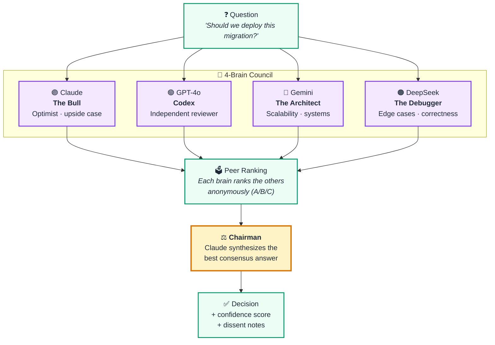
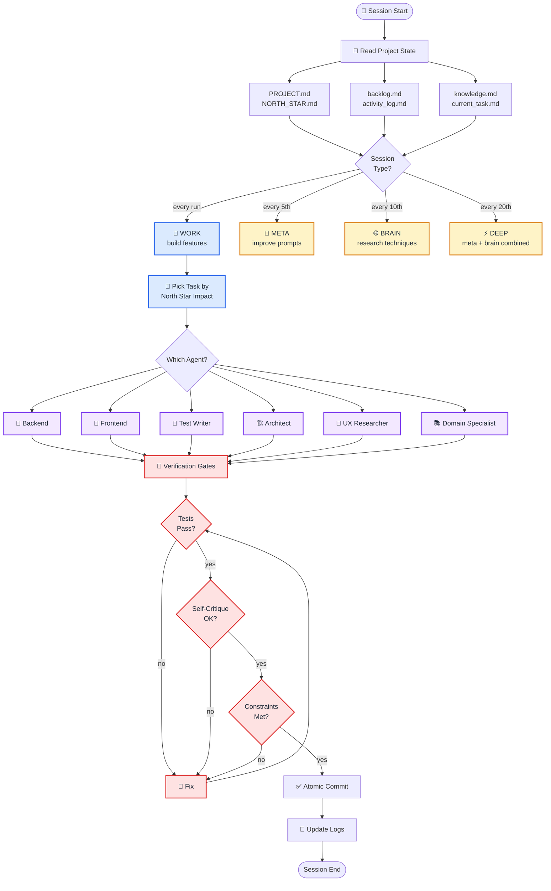
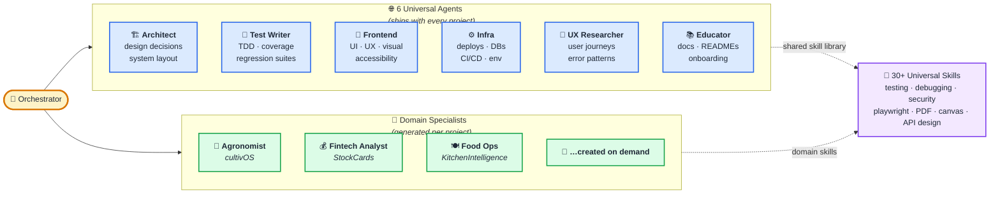
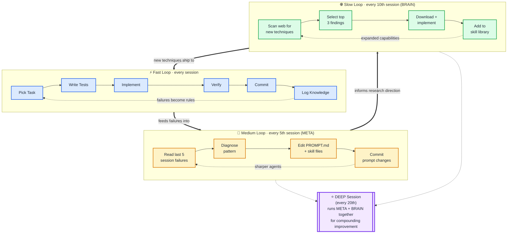
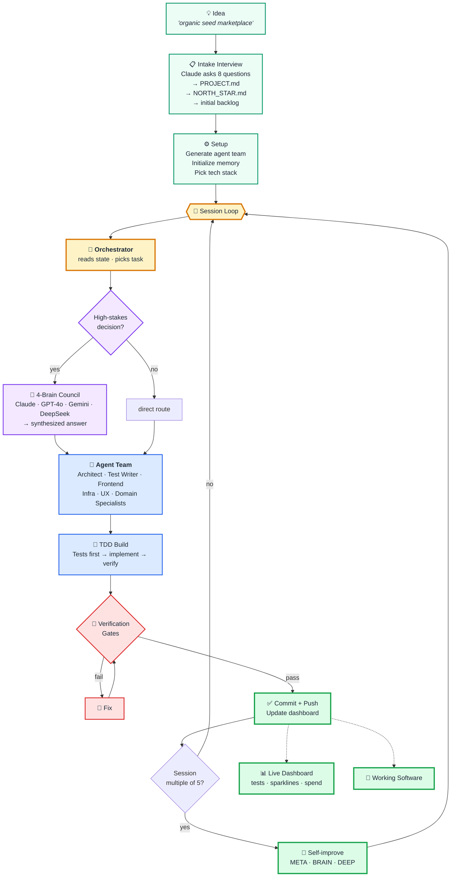

# AutoAgent Agency — Visual Explainer

Five diagrams that explain how AutoAgent works. All rendered via Mermaid — they display natively on GitHub, in Gamma, and in Notion. To export any diagram as PNG/SVG: copy the code block into [mermaid.live](https://mermaid.live) and click **Actions → PNG** or **SVG**.

---

## 1. The 4-Brain Council

When a decision matters, AutoAgent doesn't trust a single model. It asks four different AI systems from different labs, each with a different perspective, then a Chairman synthesizes the best answer.



**Why four, not one?** Different training data, different architectures, different blind spots. A bug Claude misses, DeepSeek often catches. A scalability concern Gemini flags, Codex validates. The Chairman sees all four answers *and* the peer rankings — then synthesizes.

---

## 2. The Orchestrator

The Orchestrator is the conductor. It picks what to work on next, routes it to the right specialist, and enforces the rules (tests first, commit atomically, no scope creep).



**Core principle:** the Orchestrator never writes code itself. It reads state, chooses work, routes to specialists, and enforces gates. Separation of decision from execution.

---

## 3. The Agent Teams

Every project starts with 6 universal agents. Domain specialists are created during intake or on-demand. Each agent has its own system prompt, skills, and responsibilities.



**Backlog routing:** tasks tagged `[agent: test-writer]` route to the Test Writer; `[agent: agronomist]` routes to a domain specialist. The Orchestrator decides which agent sees the task based on tag, skill match, and history of success with similar work.

---

## 4. Self-Improving Loops

AutoAgent gets better at building software the longer it runs. Three loops operate at different timescales.



**Why it compounds:** the Fast Loop writes code and logs failures. The Medium Loop reads those failures and rewrites the prompts that caused them. The Slow Loop researches techniques humans are publishing *right now* and adds them to the skill library. Every loop feeds the next.

---

## 5. The Whole System

Everything together: idea in → working software out, autonomously, with compounding quality.



---

## How to Export as Images

**Option 1 — mermaid.live (fastest, no install)**
1. Go to https://mermaid.live
2. Paste any code block above into the editor (left panel)
3. Click **Actions → PNG** or **SVG** to download
4. The export is transparent-background, high-res, ready for slides

**Option 2 — Gamma (build the deck directly)**
1. Create a new Gamma deck
2. Paste the relevant sections of this markdown into the "import from text" flow
3. Gamma renders the mermaid code blocks as embedded diagrams
4. You can restyle with the AI designer

**Option 3 — mermaid-cli (local batch export)**
```bash
npm install -g @mermaid-js/mermaid-cli
mmdc -i docs/VISUAL_EXPLAINER.md -o docs/diagrams.png
```

**Option 4 — NotebookLM**
Upload this markdown file as a source. Generate an Audio Overview — the AI hosts will walk through all 5 concepts in podcast format.

---

## Narrative Summary (for voice-over / NotebookLM)

AutoAgent is a multi-agent AI development framework that takes an idea and autonomously builds working software. It has three distinct advantages over single-agent coding assistants.

First, **the Council**. High-stakes decisions route through four different AI models from four different labs — Claude, GPT-4o, Gemini, and DeepSeek. Each has a different training and different blind spots. They answer independently, peer-rank each other's answers anonymously, then a Chairman synthesizes the best response. This catches bugs a single model would miss.

Second, **specialized agents**. Every project ships with six universal agents — Architect, Test Writer, Frontend, Infra, UX Researcher, Educator — plus domain specialists generated during intake. An Orchestrator reads the project state, picks the highest-impact task, routes it to the right specialist, and enforces verification gates before any commit lands.

Third, **self-improvement**. Work sessions build features and log failures. Every fifth session, a Meta loop reads those failures and rewrites the prompts that caused them. Every tenth session, a Brain loop scans the web for new techniques and adds them to the skill library. The longer the system runs, the better it gets.

One human describes the goal, walks away, and comes back to working software with tests, commits, and a live dashboard showing what shipped.
